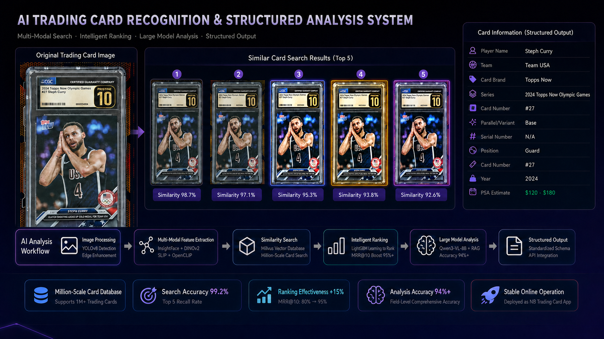

# Sports Card Scope AI

<strong>Multimodal Trading Card Search, Intelligent Ranking and Structured Intelligence</strong>

<a href="README_zh-CN.md">简体中文</a> · <a href="#quick-start">Quick Start</a> · <a href="#api-endpoint-coverage">API</a>

    

## Overview

CardScope AI is an end-to-end intelligent platform for sports cards and collectible trading cards. A single uploaded image flows through card localization, geometric normalization, multimodal feature extraction, vector recall, learning-to-rank, visual-language parsing, and knowledge-enhanced structured output.

It is built for reflections, angled shots, busy backgrounds, mixed Chinese-English text, near-identical parallels, serial numbers, grading labels, and fragmented marketplace metadata.

**Image → Normalize → Retrieve → Rerank → Understand → Structure → Serve**

## Features

- YOLOv8 detection/segmentation, crop, perspective correction and orientation normalization.
- InsightFace buffalo_s, DINOv2 facebook/dinov2-with-registers-base, SLIP ConvNeXt convnext_base_w, and OpenCLIP ViT-H-14 fusion.
- Milvus HNSW ANN retrieval with player, marketplace and status filters.
- LightGBM learning-to-rank using embedding, HOG/contour, border and metadata signals.
- Qwen3-VL-8B OCR through Ollama for single-side and double-side cards.
- ChromaDB + BGE-M3 semantic, field and multi-condition RAG search.
- FastAPI APIs, dependency diagnostics, concurrency control, Docker and Streamlit operations UI.
- Qwen3-VL LoRA training/evaluation and LightGBM ranker training workflows.

## Key Capabilities

### Multimodal retrieval

Four complementary visual streams are fused into a 2,304-dimensional search representation. Milvus HNSW returns fast candidates while preserving product metadata and filters.

### Intelligent ranking

LightGBM converts raw similarity into a stronger final order with visual, contour, border and metadata features. The same ranker can be trained offline and enabled in the API.

### Card understanding

Qwen3-VL parses front/back imagery into a stable schema: player, team, brand, series, card number, parallel/variant, serial number, position, year and grading fields.

### Knowledge-enhanced structure

ChromaDB stores card descriptions and metadata for semantic retrieval, field lookup, Excel import and RAG-assisted correction. The Streamlit viewer makes the collection inspectable.

## Architecture

~~~mermaid
flowchart LR
    A[Card image] --> B[YOLOv8 normalize]
    B --> C[InsightFace + DINOv2 + SLIP + OpenCLIP]
    C --> D[Milvus HNSW recall]
    D --> E[LightGBM rerank]
    B --> F[Qwen3-VL OCR]
    F --> G[ChromaDB + BGE-M3 RAG]
    E --> H[Ranked products]
    G --> I[Structured card JSON]
~~~

## Requirements

Python 3.10–3.13, Git, 8 GB+ RAM, CUDA for high-throughput embedding/LoRA training, Milvus for vector retrieval, and Ollama for Qwen3-VL OCR.

## Installation

~~~bash
git clone <your-github-url>/cardscope-ai.git
cd cardscope-ai
python -m venv .venv
pip install -e ".[dev,retrieval,preprocessing,ranking,parsing]"
copy .env.example .env
~~~

## Quick Start

~~~bash
card-pipeline-api
uvicorn router.api:app --host 0.0.0.0 --port 8000
card-pipeline-doctor
docker compose up -d
card-pipeline-create-collection
card-pipeline-index-images data/cards --batch-size 100
~~~

Open http://localhost:8000/docs for the interactive OpenAPI console.

## Usage Examples

### Search

~~~bash
curl -X POST http://localhost:8000/api/v1/retrieval/search -F "image=@card.jpg" -F "top_k=5" -F "rerank=true"
~~~

### YOLO segmentation and normalization

~~~dotenv
CARD_PIPELINE_PREPROCESSING_MODE=yolo
CARD_PIPELINE_YOLO_MODEL_PATH=models/detection/yolov8_card.pt
~~~

YOLO is applied automatically during indexing and retrieval.

### OCR

~~~bash
ollama serve
ollama pull qwen3-vl:8b-instruct-q8_0
curl -X POST http://localhost:8000/api/v1/ocr/recognize/single -F "image=@card.jpg" -F 'fields=["name","brand","series","card_number"]'
curl -X POST http://localhost:8000/api/v1/ocr/recognize/double -F "front=@front.jpg" -F "back=@back.jpg"
~~~

### RAG and viewer

~~~bash
curl http://localhost:8000/api/v1/rag/fields
curl http://localhost:8000/api/v1/rag/count
curl -X POST http://localhost:8000/api/v1/rag/search -H "Content-Type: application/json" -d '{"query":"Stephen Curry 2024 Olympic Games","top_k":5}'
card-pipeline-chroma-viewer
streamlit run src/knowledge/chroma_viewer.py
~~~

### OCR training and evaluation

~~~bash
python -m ocr_trainer.prepare_dataset data/annotations.jsonl data/llamafactory
python -m ocr_trainer.train data/llamafactory Qwen/Qwen3-VL-8B-Instruct outputs/card-ocr-lora
python -m ocr_trainer.predict data/eval.jsonl Qwen/Qwen3-VL-8B-Instruct data/predictions.jsonl --adapter outputs/card-ocr-lora
python -m ocr_trainer.evaluate data/eval.jsonl data/predictions.jsonl
~~~

### LightGBM ranker

~~~bash
card-pipeline-train-ranker data/ranking.csv models/ranking/ranking_model.joblib --enable-env .env
~~~

## API Endpoint Coverage

| Area | Endpoints |
|---|---|
| Health | GET /health |
| Retrieval | POST /api/v1/retrieval/search |
| OCR | GET /api/v1/ocr/fields; POST /api/v1/ocr/recognize/single; POST /api/v1/ocr/recognize/double |
| RAG | GET /api/v1/rag/fields; GET /api/v1/rag/count; card CRUD; batch import; semantic/field/multi search and Excel import |
| Diagnostics | GET /api/v1/system/dependencies |

## Project Structure

~~~text
src/{preprocessing,models,retrieval,rerank,ocr_parsing,knowledge,service,router}
scripts/
ocr_trainer/
configs/
tests/
assets/
~~~

## Model and Data Workflow

~~~text
models/detection/yolov8_card.pt
models/ranking/ranking_model.joblib
models/rag/BAAI/bge-m3/
data/cards/
data/ocr/{train,validation,test}.*
~~~

The .env.example file centralizes device, Milvus, Ollama, ChromaDB, embedding cache and model-path configuration.

## Model and Data Link

This link provides a cropped YOLOv8 model and data on over 100,000 player trading cards:

## Evaluation

~~~bash
pytest
~~~

The OCR evaluator reports record accuracy, micro/macro field accuracy, per-field accuracy and presence precision/recall/F1. Retrieval experiments measure Recall@K and MRR@K from gallery labels.

## Docker

~~~bash
docker build -t cardscope-ai .
docker run --rm -p 8000:8000 --env-file .env -v ./models:/app/models -v ./data:/app/data cardscope-ai
~~~

## License

See LICENSE. Review the licenses of Qwen, InsightFace, DINOv2, OpenCLIP/SLIP, YOLOv8, BGE-M3, Milvus, ChromaDB and project datasets before redistribution.

## Acknowledgements

Ultralytics, InsightFace, Meta DINOv2, LAION OpenCLIP/SLIP, LightGBM, Milvus, ChromaDB, Ollama, Qwen and LLaMA Factory.

## Disclaimer

CardScope AI is an engineering and research toolkit. Similarity and extracted fields should be reviewed for high-value cards, authentication, pricing and inventory decisions. Operators are responsible for data rights, model licenses, security and deployment policies.
