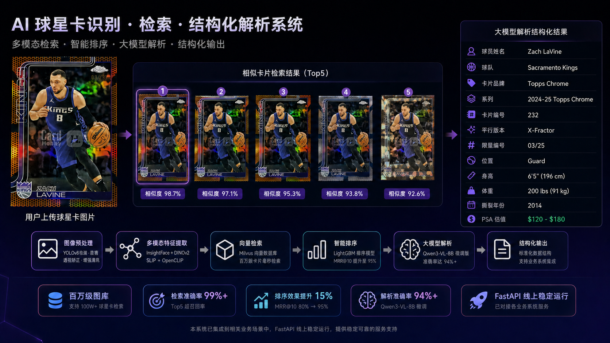

# Sports Card Scope AI

<strong>球星卡多模态检索、智能排序与结构化解析平台</strong>

<a href="README.md">English</a> · <a href="#快速开始">快速开始</a> · <a href="#api-接口覆盖">API 接口</a>

## Overview

CardScope AI 面向球星卡与收藏卡，构建从图像上传到结构化结果的完整智能链路：

**图像 → 卡片检测 → 多模态特征 → Milvus 召回 → LightGBM 精排 → Qwen3-VL 解析 → ChromaDB RAG → 标准化输出**

系统专门处理反光、倾斜拍摄、复杂背景、中英文混排、平行版高度相似、序列号和商品元数据碎片化等真实场景。

## Features

- YOLOv8 卡片检测/分割、裁剪、透视矫正、角度归一化与质量控制。
- InsightFace buffalo_s、DINOv2 facebook/dinov2-with-registers-base、SLIP ConvNeXt convnext_base_w、OpenCLIP ViT-H-14 四路特征融合。
- Milvus HNSW 百万级 ANN 检索，支持球员、平台、状态等过滤。
- LightGBM 学习排序，融合 embedding、HOG/轮廓、边框和元数据特征。
- Ollama Qwen3-VL-8B 单面/双面 OCR 与字段抽取。
- ChromaDB + BGE-M3 语义搜索、字段搜索、多条件搜索与 RAG 增强。
- FastAPI 线上接口、依赖诊断、并发控制、Docker 和 Streamlit 运维界面。
- Qwen3-VL LoRA 训练/评测与 LightGBM 精排模型训练工作流。

## Key Capabilities

### 多模态检索

四路视觉表示融合为 2,304 维检索向量，Milvus HNSW 完成快速候选召回，同时保留商品元数据与筛选条件。

### 智能精排

LightGBM 将初始相似度、轮廓纹理、边框相似度和元数据转化为更可靠的结果顺序，支持离线训练并直接接入 API。

### 球星卡理解

Qwen3-VL 支持正反面图像解析，输出球员、球队、品牌、系列、卡号、平行版、序列号、位置、年份和评级字段。

### 知识增强结构化

ChromaDB 保存卡片描述与元数据，提供语义召回、字段查找、Excel 导入和 RAG 辅助纠错；同一知识库同时支持 API 与可视化查看器。

## Architecture

~~~mermaid
flowchart LR
    A[卡片图像] --> B[YOLOv8 检测与归一化]
    B --> C[InsightFace + DINOv2 + SLIP + OpenCLIP]
    C --> D[Milvus HNSW 召回]
    D --> E[LightGBM 精排]
    B --> F[Qwen3-VL OCR]
    F --> G[ChromaDB + BGE-M3 RAG]
    E --> H[相似商品结果]
    G --> I[结构化卡片 JSON]
~~~

## Requirements

Python 3.10–3.13、Git、8GB 以上内存；高吞吐 embedding 与 LoRA 训练建议使用 CUDA；向量检索使用 Milvus；OCR 使用 Ollama。

## Installation

~~~bash
git clone <your-github-url>/cardscope-ai.git
cd cardscope-ai
python -m venv .venv
pip install -e ".[dev,retrieval,preprocessing,ranking,parsing]"
copy .env.example .env
~~~

## 快速开始

~~~bash
card-pipeline-api
uvicorn router.api:app --host 0.0.0.0 --port 8000
card-pipeline-doctor
docker compose up -d
card-pipeline-create-collection
card-pipeline-index-images data/cards --batch-size 100
~~~

启动后打开 http://localhost:8000/docs 使用交互式 OpenAPI 控制台。

## Usage Examples

### 相似卡搜索

~~~bash
curl -X POST http://localhost:8000/api/v1/retrieval/search -F "image=@card.jpg" -F "top_k=5" -F "rerank=true"
~~~

### YOLO 分割与图像归一化

~~~dotenv
CARD_PIPELINE_PREPROCESSING_MODE=yolo
CARD_PIPELINE_YOLO_MODEL_PATH=models/detection/yolov8_card.pt
~~~

索引与检索时会自动完成卡片检测、裁剪和标准化。

### OCR 识别

因为资源限制原因，尚未能提供经过LoRA微调训练的Qwen3-VL模型，仓库原生项目使用的是Ollama上的Qwen3-VL-8B模型，实际测试也有90%+的准确性

~~~bash
ollama serve
ollama pull qwen3-vl:8b-instruct-q8_0
curl -X POST http://localhost:8000/api/v1/ocr/recognize/single -F "image=@card.jpg" -F 'fields=["name","brand","series","card_number"]'
curl -X POST http://localhost:8000/api/v1/ocr/recognize/double -F "front=@front.jpg" -F "back=@back.jpg"
~~~

### RAG 与可视化

~~~bash
curl http://localhost:8000/api/v1/rag/fields
curl http://localhost:8000/api/v1/rag/count
curl -X POST http://localhost:8000/api/v1/rag/search -H "Content-Type: application/json" -d '{"query":"Stephen Curry 2024 Olympic Games","top_k":5}'
card-pipeline-chroma-viewer
streamlit run src/knowledge/chroma_viewer.py
~~~

### OCR 训练和评测

~~~bash
python -m ocr_trainer.prepare_dataset data/annotations.jsonl data/llamafactory
python -m ocr_trainer.train data/llamafactory Qwen/Qwen3-VL-8B-Instruct outputs/card-ocr-lora
python -m ocr_trainer.predict data/eval.jsonl Qwen/Qwen3-VL-8B-Instruct data/predictions.jsonl --adapter outputs/card-ocr-lora
python -m ocr_trainer.evaluate data/eval.jsonl data/predictions.jsonl
~~~

### LightGBM 精排训练

~~~bash
card-pipeline-train-ranker data/ranking.csv models/ranking/ranking_model.joblib --enable-env .env
~~~

## API 接口覆盖

| 模块 | 接口 |
|---|---|
| 健康检查 | GET /health |
| 图像检索 | POST /api/v1/retrieval/search |
| OCR | GET /api/v1/ocr/fields；POST /api/v1/ocr/recognize/single；POST /api/v1/ocr/recognize/double |
| RAG | GET /api/v1/rag/fields；GET /api/v1/rag/count；卡片 CRUD、批量导入、语义/字段/多条件搜索、Excel 导入 |
| 诊断 | GET /api/v1/system/dependencies |

## Project Structure

~~~text
src/{preprocessing,models,retrieval,rerank,ocr_parsing,knowledge,service,router}
scripts/
ocr_trainer/
configs/
tests/
assets/
~~~

## Model and Data Workflow

~~~text
models/detection/yolov8_card.pt
models/ranking/ranking_model.joblib
models/rag/BAAI/bge-m3/
data/cards/
data/ocr/{train,validation,test}.*
~~~

.env.example 集中管理设备、Milvus、Ollama、ChromaDB、embedding 缓存和模型路径。

## Model and Data Link

此链接提供了一个裁剪后的 YOLOv8 模型、超过 20 万张球员交易卡的数据，以及适合 OCR 训练后处理的手动标注体育交易卡图像数据：[URL](https://pan.baidu.com/s/1wDWb0PMgmPj3HC7ysD4f4g?pwd=z78a)

## Evaluation

~~~bash
pytest
~~~

OCR 评测输出记录准确率、micro/macro 字段准确率、逐字段准确率和 presence precision/recall/F1；检索实验输出 Recall@K 与 MRR@K。

## Docker

~~~bash
docker build -t cardscope-ai .
docker run --rm -p 8000:8000 --env-file .env -v ./models:/app/models -v ./data:/app/data cardscope-ai
~~~

## License

详见 LICENSE。发布前请分别核对 Qwen、InsightFace、DINOv2、OpenCLIP/SLIP、YOLOv8、BGE-M3、Milvus、ChromaDB 及项目数据集的许可证。

## Acknowledgements

感谢 Ultralytics、InsightFace、Meta DINOv2、LAION OpenCLIP/SLIP、LightGBM、Milvus、ChromaDB、Ollama、Qwen 和 LLaMA Factory 社区。

## Disclaimer

CardScope AI 是工程与研究工具。高价值卡片、鉴定、定价和库存决策应结合人工复核；使用者负责数据授权、模型许可证、安全策略和线上部署管理。
